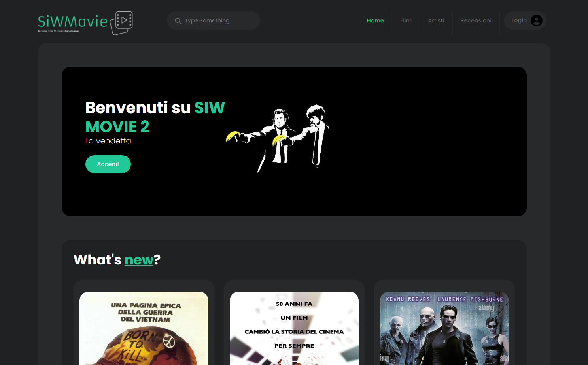

# SiwMovie 2 - La Vendetta
Progetto realizzato per il corso Sistemi Informativi su Web tenuto dal Prof. Paolo Merialdo.

## General Informations
Si tratta di un sistema informativo che offre e gestisce informazioni relative a film, attori, registi e recensioni.

## Technologies
Il progetto è stato realizzato usando:
* Spring Framework 4
    * Java 17
    * Thymeleaf
    * PostgreSQL 15
* Bootstrap 5.2.0

## Setup

1. `$ git clone https://github.com/hermann0001/siw-movie2.git`                    
2. Importa il progetto in un IDE con almeno **Java 17** installato (e.g. Eclipse, IntelliJ, ...)
3. Compila ed esegui la classe `SiwMovie03Application.java`

## Screenshot

